# Astronomy Shop — synthetic monitoring proof of concept

Prepared for the Astronomy Corporation engineering team.

Your team already has strong visibility into the platform: Grafana, metrics, logs, and traces
across every service. The gap isn't observability, it's perspective. In the last few incidents,
customers noticed a problem before your own alerting did, because nothing in the current stack
experiences the app the way a customer does — from outside, over the network, clicking through
the actual purchase flow.


This repo is that missing layer: three Checkly checks, chosen for your specific failure history,
defined entirely as code so your team can read, extend, and own them the same way you own
application code. Everything below is written so an engineer who has never seen this repo can
get it running, understand why it's shaped this way, and extend it without us in the room.

Every check has been run against a real target, deployed to a real Checkly account, and proven
against a full staged incident hour, six real failures injected on purpose, watched, and
recovered. Every screenshot in this README is from that account, not a mockup.

## What's monitored, and why

**1. Browser check — the purchase journey** ([storefront-purchase.spec.ts](__checks__/storefront-purchase.spec.ts), every 5 minutes)

Home page -> product page -> add to cart -> place order -> order confirmation. This is your
revenue path. In the incidents you described, infrastructure dashboards stayed green while
customers could not complete an action. A journey check fails the moment a real customer would
fail, regardless of which backend service caused it. We verified this against your exact incident
class: with the `paymentFailure` flag at 100%, every container kept reporting healthy, and this
check failed at the confirmation step. That gap between "infra healthy" and "customer blocked" is
what this check closes.

| The order it asserts | The failure it catches |
|---|---|
| 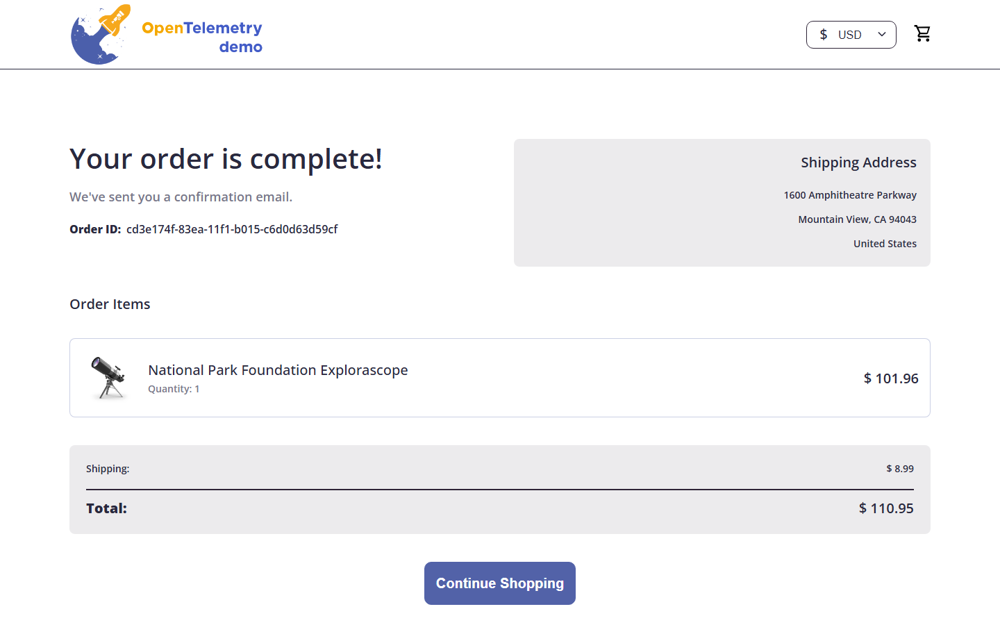 | 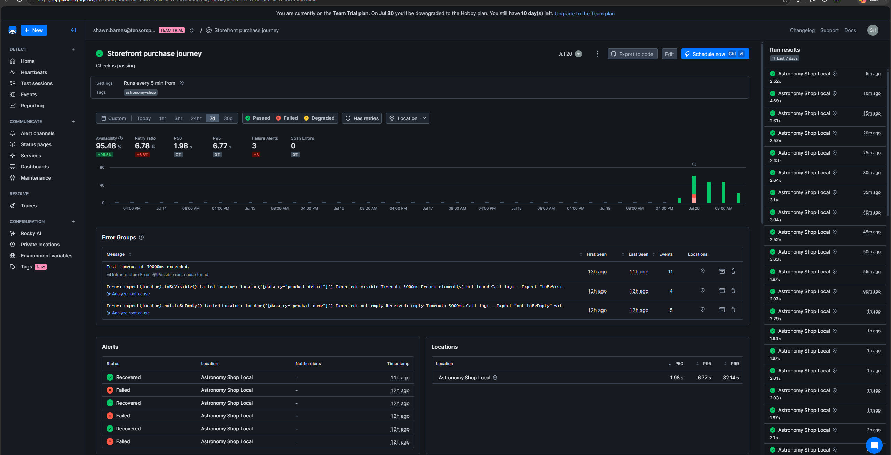 |

That second screenshot is the check's real result history, not a staged demo: 95.48% availability
over the window shown, three failure alerts, and an error group Checkly's own Rocky AI flagged
with a "possible root cause found" link, all from the staged incident hour below. In the staged
hour, this one check went red for three separate backend causes — payment, catalog, and cart —
without needing a different alert pre-built for each one.

**2. Browser check — homepage image render budget** ([homepage-render-performance.spec.ts](__checks__/homepage-render-performance.spec.ts), every 5 minutes)

This one catches a failure class your current stack structurally cannot see. Your `imageSlowLoad`
flag injects latency at the edge, Envoy fault injection on the image fetch, not inside any
instrumented service. No backend span ever represents it, because no backend service is actually
slow. We proved this: every container kept reporting healthy while the product image took 5.2
seconds to arrive, over 15x the 2-second budget this check asserts. Distributed tracing has no
span for "the customer is staring at a blank box." An outside timer does.

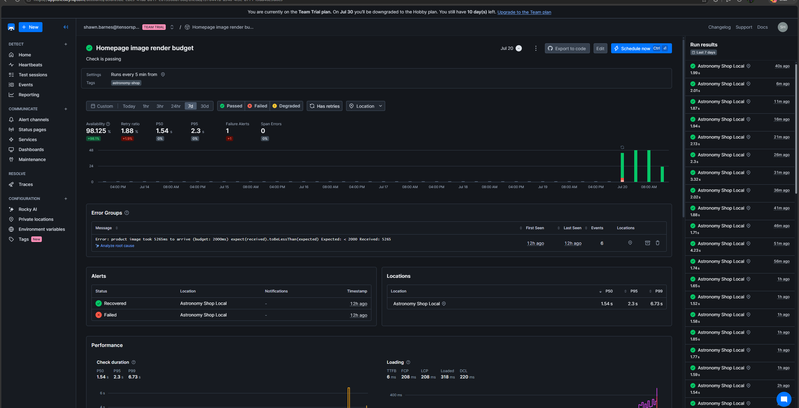

The error group text is the check's own words: `product image took 5265ms to arrive (budget:
2000ms)`. Availability over the window shown: 98.125%.

**3. API check — product catalog** ([checks.check.ts](__checks__/checks.check.ts), every minute)

`GET /api/products/OLJCESPC7Z` with assertions on status, product name, and a non-zero price
(not just a 200). Two reasons for pinning this product: it's a real catalog item your customers
hit from the homepage, and it's the product your `productCatalogFailure` flag is scoped to break,
so this one check also covers single-SKU failures a whole-site ping would never catch. Degrades
at 1s, fails at 5s — a slow catalog is customer-visible long before it's an outage.

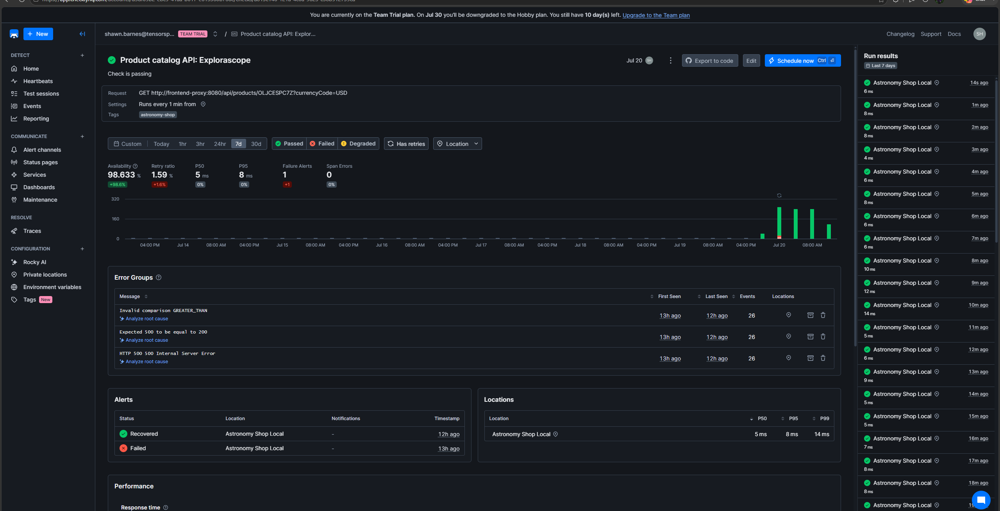

During the incident, this product returned `HTTP 500` while every sibling product kept returning
`200` and the homepage stayed up. A whole-site ping would have reported everything healthy.

**Deliberately not built:** a check per service, uptime pings on every endpoint, alert-channel
sprawl. Three checks that map to your stated pain beat twenty that map to the service list. Your
Grafana/OTel stack stays exactly where it is — this detects from the outside, your traces still
explain from the inside.

## Retry policy

One retry after 30 seconds, same region, before a check counts as failed. This is deliberate:
alerting on the first blip trains a team to ignore alerts, which is close to how the last few
incidents reached your customers before your own tooling. This kills single-blip false alarms
without meaningfully delaying detection of a real outage.

## Test data

Checkout is pre-filled with test data (example.com email, a test card), so the journey check
places real orders through your real checkout, payment, and shipping services without touching
anything sensitive. Before this runs against production, we'd tag synthetic traffic the same way
your own load generator already does, with an OTel Baggage attribute, so synthetic orders are
excluded from business metrics and don't skew your dashboards.

## The account, live

Deployed entirely from this repo (`checkly.config.ts` + `__checks__/`), including the public
status dashboard, which is also a construct in code, not a UI setting.

| All checks, live | Public status page |
|---|---|
| 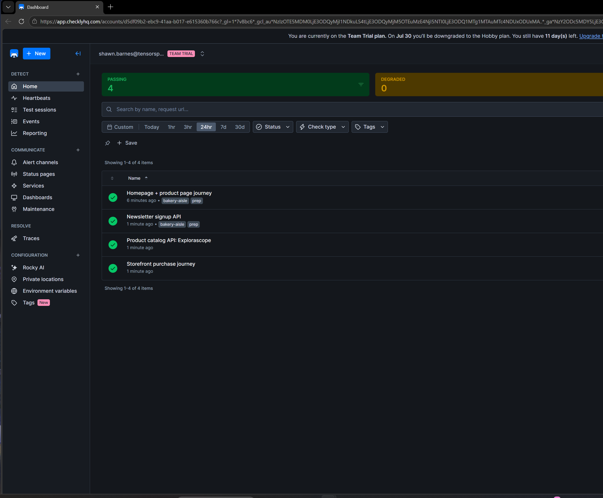 | 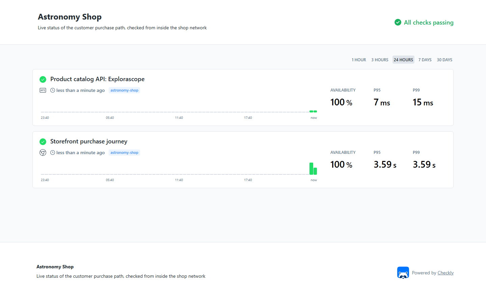 |

The private location agent, the thing that lets these checks reach an environment that isn't
publicly exposed, is connected and reporting:

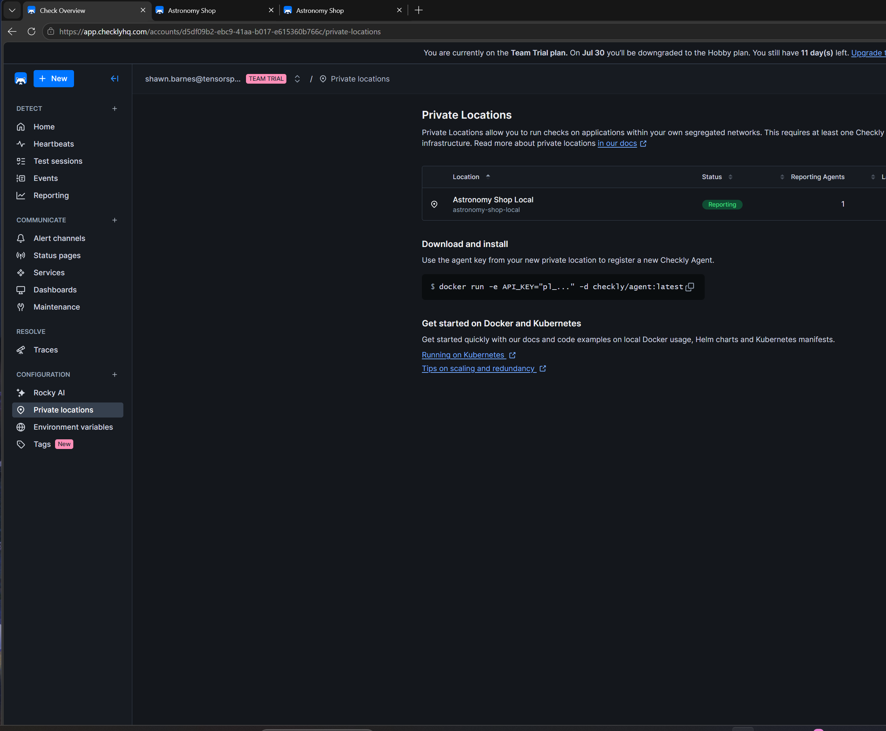

## The staged incident hour

Beyond the individual proof cycles described above, we ran a full hour against the live,
scheduled checks, not local one-off tests, injecting six real failures back to back through the
app's own feature flags, each verified, each reverted, with the public dashboard captured at
every phase boundary. This is why the check screenshots above show real incident bands instead of
a flat green history.

| Phase | What was broken | What happened |
|---|---|---|
| 1 | Single product (`productCatalogFailure`) | Catalog check red, journey red, render check correctly green |
| 2 | Image latency (`imageSlowLoad`) | Render check red at ~5.2s, others recovered green |
| 3 | Payment (`paymentFailure` 100%) | Journey red at confirmation, others green |
| 4 | Ads + recommendation cache, both at once | **All three checks stayed green** — customers could still buy |
| 5 | Cart (`cartFailure` 100%) | Journey red again, a third distinct backend cause |
| 6 | Everything reverted | All three checks verified passing on schedule again |

Phase 4 is the one worth sitting with: two backend services were actively broken for ten minutes,
and nothing paged, because a customer's ability to browse and buy was never actually interrupted.
These checks page on customer impact, not on internal component health, which is what keeps a
team trusting the alert instead of muting it.

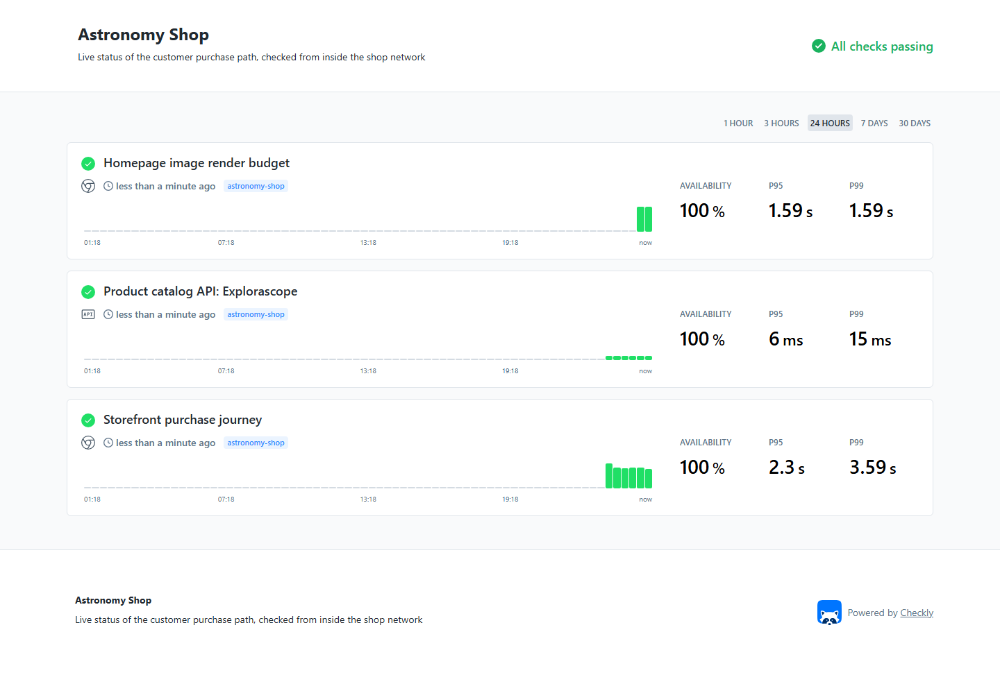
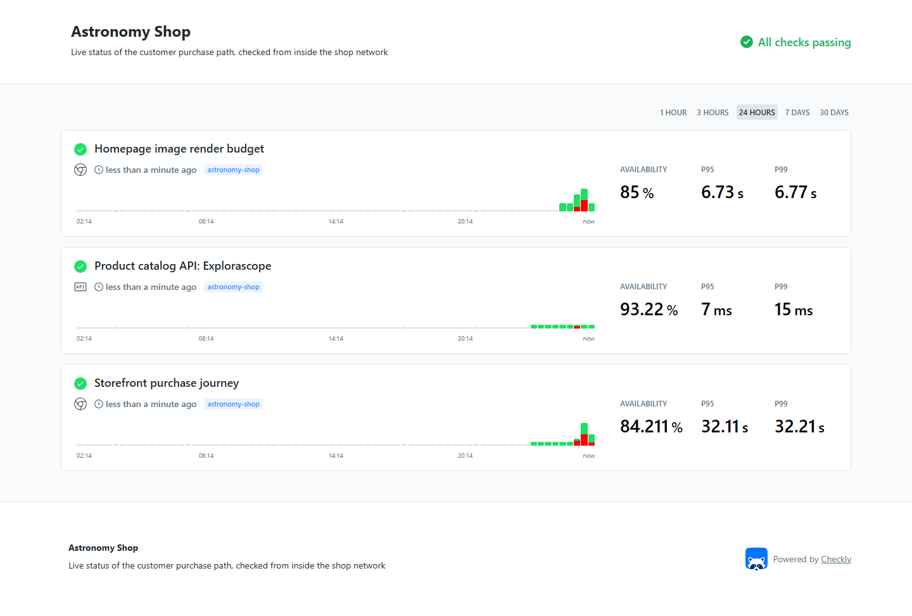
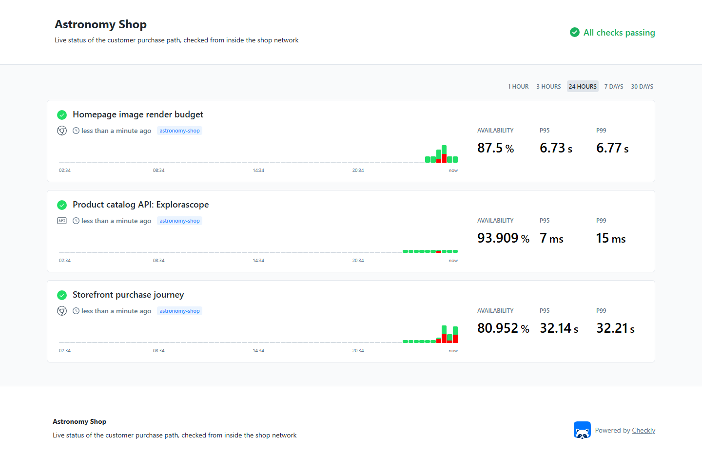

## Getting this running on your side

```bash
# 1. Start the target app
cd opentelemetry-demo
docker compose --env-file .env --env-file .env.override \
  -f compose.yaml -f compose.observability.yaml -f compose.extras.yaml up -d

# 2. Run the journey check locally before touching Checkly at all
npm install
npx playwright test __checks__/storefront-purchase.spec.ts

# 3. Stand up a Private Location so Checkly can reach the app on your
#    internal network, the same way it would reach your real staging
#    or production environment. Create the location in Checkly (slug:
#    astronomy-shop-local), then join the agent to the app's own
#    Docker network — it reaches the storefront by service name
#    (http://frontend-proxy:8080), nothing exposed outward.
docker run -d --name checkly-agent --restart unless-stopped \
  --network opentelemetry-demo \
  -e API_KEY="pl_..." checkly/agent:latest

# 4. Ship it
npx checkly login
npx checkly deploy
```

## Reproducing the incident classes this was built for

```bash
# Payment errors, infra stays green:
# Flip paymentFailure to 100% in opentelemetry-demo/src/flagd/demo.flagd.json,
# or live via http://localhost:8080/feature. Every container stays healthy.
# The journey check fails at order confirmation. Flip back to "off" to recover.

# Nothing errors, it's just slow, and tracing can't see it:
# Flip imageSlowLoad to "5sec" the same way. Every container stays healthy,
# every trace stays clean, no service is actually down. The render-budget
# check fails at ~5.2s against a 2s budget. Flip back to "off" to recover.

# One product down, the rest of the site looks fine:
# productCatalogFailure uses a targeting rule scoped to one product ID, not
# a simple on/off default. Set the rule's true branch to "on" for that
# product (the /feature UI does this for you). Every sibling product keeps
# returning 200; only the pinned product 500s.
```

## Extending this

The pattern here generalizes past these three checks. If your team wants to add coverage:

- New user journey -> a new Playwright spec + a `BrowserCheck` construct in `__checks__/`.
- New backend dependency -> an `ApiCheck` construct with assertions on the fields that actually
  matter, not just the status code.
- Everything ships the same way: `checkly test` to dry-run against the private location,
  `checkly deploy` to make it live. No UI clicking, no drift between what's live and what's in
  the repo. Review monitoring changes the same way you review application code, in a pull
  request, before they ship.

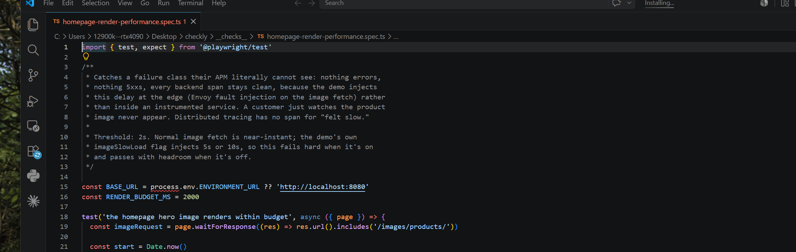
